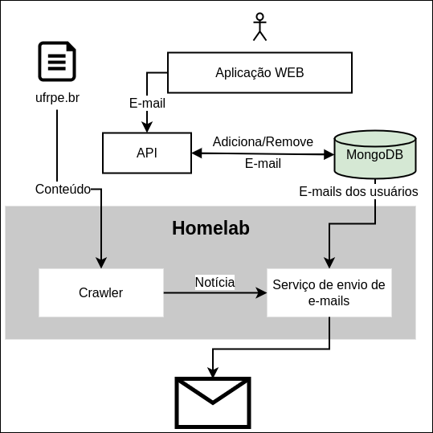
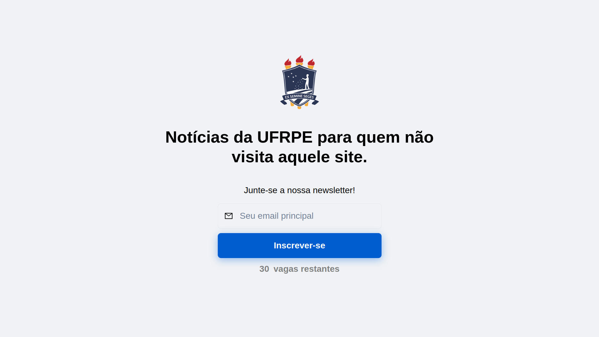

# ufrpe-newsletter

## Sumário
- [ufrpe-newsletter](#ufrpe-newsletter)
  - [Sumário](#sumário)
  - [Funcionamento do projeto](#funcionamento-do-projeto)
  - [Módulos](#módulos)
    - [frontend](#frontend)
    - [email-service](#email-service)
    - [crawler](#crawler)
    - [gateway](#gateway)

## Funcionamento do projeto



## Módulos

### frontend

<p align="left">


</p>

[Repositório](https://github.com/LuanAccioly/web-newsletter)

Módulo responsável pela interface do usuário. Aqui, você pode cadastrar seu e-mail para a newsletter.

#### Funcionamento



#### Tecnologias utilizadas

- **Chakra UI:** Uma biblioteca de componentes React que facilita a criação de interfaces modernas e responsivas.
- **Axios:** Utilizado para realizar requisições HTTP, permitindo a comunicação com o [gateway](#gateway) para cadastrar e remover e-mails.
- **Vercel**: Plataforma de hospedagem.

---

### email-service


<p align="left">


</p>

[Repositório](https://github.com/LuanAccioly/email-service-newsletter)

Responsável por gerenciar o envio de notícias para a lista de e-mails cadastrados, provenientes do MongoDB. Utilizamos a biblioteca ExpressJS para criar rotas, sendo acessíveis apenas localmente no servidor para evitar interceptações não autorizadas nas rotas responsáveis pelo envio de e-mails.

#### Tecnologias utilizadas

- **Express:** Framework para Node.js utilizado na criação de rotas HTTP e gerenciamento de requisições.
- **Docker:**  Utilizado para encapsular o serviço em uma imagem, permitindo a execução consistente e isolada em diferentes ambientes.
- **MongoDB:** Banco de dados utilizado para armazenar a lista de e-mails cadastrados.
- **Axios:** Utilizado para a comunicação via rotas HTTP com o módulo Crawler Newsletter para receber as notícias.

#### Funcionamento

O email-service foi projetado para rodar como uma imagem Docker no servidor. Ele recebe as notícias formatadas do módulo [crawler](#crawler) via rotas HTTP internas. A lista de e-mails é recuperada do MongoDB, e o email-service é responsável por distribuir as notícias para os endereços cadastrados.

#### Segurança

Para garantir a segurança das operações, este módulo foi pensado para ser acessível apenas localmente no servidor, prevenindo possíveis interceptações de terceiros.

#### Resultado

##### Desktop


##### Mobile


---

### crawler


<p align="left">


</p>

[Repositório](https://github.com/LuanAccioly/crawler-newsletter)

Responsável por extrair informações relevantes sobre notícias do site da Universidade Federal Rural de Pernambuco (UFRPE). O script utiliza a biblioteca Selenium para navegar de forma automatizada pelo site, e a biblioteca BeautifulSoup para realizar o parsing do conteúdo HTML.

#### Funcionamento

**1. Verificação de novas notícias**

   - Compara o título da última notícia extraída com o título armazenado em um arquivo local.
   - Se há uma nova notícia disponível, realiza a extração completa e envia os dados para um serviço de e-mail.

**2. Extração de título, corpo e URL da última notícia**

   - Utiliza o Selenium para acessar o site da UFRPE e identificar a última notícia publicada.
   - Extrai o título, o corpo, a URL e outros elementos visuais, como imagens e links relacionados à notícia.

**3. Limpeza e formatação do conteúdo**

   - Remove quebras de linha e tags HTML indesejadas do corpo da notícia, garantindo um formato legível.

**4. Envio de notícia para [email-service](#email-service)**

  - Utiliza a biblioteca requests para enviar os dados da notícia, incluindo título, corpo, URL, imagens e links.

**Exemplo de saída do crawler:**

```javascript
{
  title: 'UFRPE promove votação para escolha da Reitoria ...', 
  body: '<p class="rtejustify">A UFRPE escolherá quem vai conduzir a Universidade na Gestão Sup...',
  url: 'https://www.ufrpe.br/br/content/ufrpe-promove-vota%C3%...', 
  images: [
    'https://www.ufrpe.br/sites/www.ufrpe.br/files/LOCAIS%20%2C...png',
  ], 
  files: [
    {
      name: 'RECU405.2023 NORMAS PARA CONSUL...pdf', 
      url: 'https://www.ufrpe.br/sites/www.ufrpe.br/files/RECU405.2023%...pdf'
    }, 
    {
      name: 'ERRATA_MAPA DE VOTAÇÃO CONSULTA PARA GES...pdf', 
      url: 'https://www.ufrpe.br/sites/www.ufrpe.br/files/ERRATA_MAPA...pdf'
    }
  ]
}
```

#### Tecnologias utilizadas

- **Selenium:** Utilizado para a automação do navegador e navegação no site.
- **BeautifulSoup:** Biblioteca para a análise de HTML, facilitando a extração de informações específicas.
- **Requests:** Utilizado para enviar dados da notícia para o serviço de e-mail.
- **Python:** Linguagem de programação principal para o desenvolvimento do script.

#### Observações:

- O script roda como uma aplicação independente e necessita do driver do Chrome instalado para o Selenium.
- A comunicação entre o Crawler e o serviço de e-mail é feita localmente, e o serviço de e-mail deve estar em execução para que o envio seja realizado com sucesso.

---

### gateway

<p align="left">


</p>

[Repositório](https://github.com/LuanAccioly/gateway-newsletter)

Atua como um intermediário seguro entre o frontend e o [email-service](#email-service). Foi concebido separadamente para garantir a segurança das rotas de envio de e-mails. Este módulo é responsável pelo cadastro e remoção de e-mails coletados pelo frontend, bem como pela validação e limitação da quantidade de e-mails cadastrados.

#### Funcionamento

- **Cadastro e Remoção de E-mails:**
  - Recebe requisições do frontend para cadastrar ou remover e-mails.
- **Validação de E-mails:**
  - Verifica se o e-mail fornecido é válido antes de realizar o cadastro.
  - Implementa medidas para limitar a quantidade de e-mails cadastrados.
- **Comunicação com o Banco de Dados:**
  - Gerencia as operações de cadastro e remoção de e-mails no banco de dados.
  - Utiliza o banco de dados para armazenar e recuperar a lista de e-mails cadastrados.

#### Tecnologias Utilizadas:

- **Express**: Framework para Node.js utilizado na criação de rotas HTTP e gerenciamento de requisições.
- **Vercel**: Plataforma de hospedagem.
